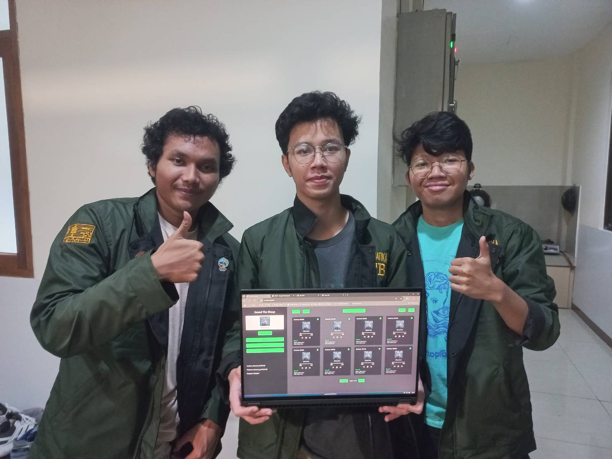
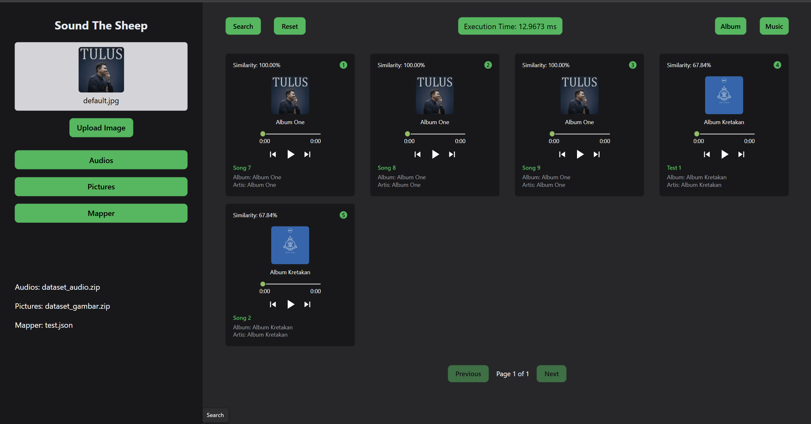
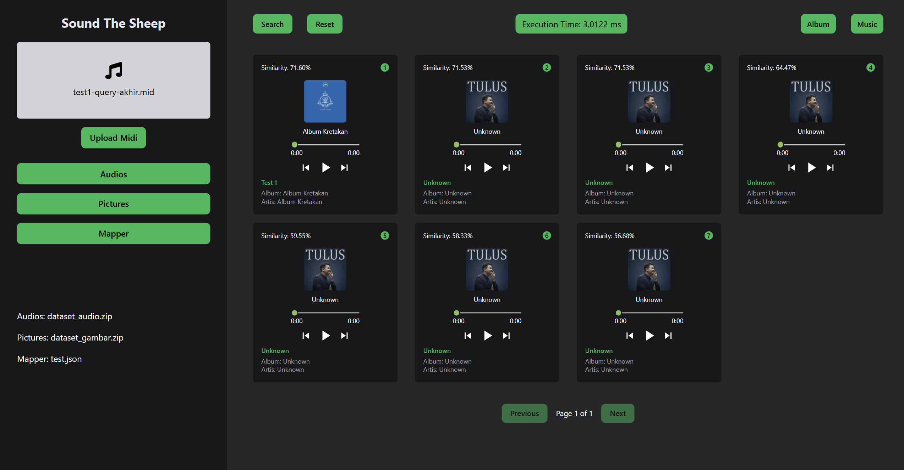

<h1 align="center">Tugas Besar 2 IF2123 Aljabar Linear dan Geometri</h1>
<h3 align="center">Image Retrieval dan Music Information Retrieval Menggunakan PCA dan Vektor</h3>



## Table of Contents

- [Description](#description)
- [Features](#features)
- [Tech Stack](#tech-stack)
- [Structure](#structure)
- [Getting Started](#getting-started)
- [Contributors](#contributors)
- [References](#references)

## Description
SoundTheSheep is a web application designed to detect and retrieve information from sounds and images within a dataset. The platform allows users to query the dataset using either MIDI audio samples or album cover images to find relevant matches.

## Features

- **Album Picture Finder - Principal Component Analysis**

  Use album cover images as queries to find related information in the dataset.

- **Music Information Retrieval - Query by Humming**

  Upload a MIDI file to search for matching sounds within the dataset.


## Tech Stack
- **Frontend**: Built with **Next.js**, ensuring a seamless and user-friendly interface.
- **Backend**: Powered by **Flask (Python)** for handling audio and image processing.

## Structure
```
├── README.md
├── src/
│   ├── backend
│   └── frontend
├── test/
│   ├── audio
│   ├── images
│   ├── mapper
|   ├── query_audio
|   └── query_image
└── doc
```
- src : contains the main program's source code files.
- doc : contains the assignment report.
- test : contains datasets and query fir testing.

## Getting Started
1. **Clone this repository:**
   ```bash
   git clone https://github.com/carllix/Algeo02-23065.git
   ```
2. **Navigate to the src directory of the program by running the following command in the terminal:**
   ```bash
   cd Algeo02-23065
   ```

### Run Server
1. **Navigate to the src/backend by running the following command in the terminal:**
   ```bash
   cd src/backend
   ```
2. **Create a virtual environment using the following command:**
    ```bash
   python -m venv .venv
   ```
3. **Activate the environment**

    **For Windows:**
    ```bash
    .venv\Scripts\activate
    ```
   **For MacOS/Linux:**
    ```bash
    source .venv/bin/activate
    ```
4. **Install the required dependencies for the program by running:**
   ```bash
   pip install -r requirements.txt
   ```
5. **Run server using the following command:**
    ```bash
   flask run --debug
   ```
### Run Client/Website
1. **Open new terminal and navigate to the src/frontend by running the following command in the terminal:**
   ```bash
   cd src/frontend
   ```
2. **Install dependencies:**
    ```bash
   npm install
   ```
3. **Run the development server:**
    ```bash
   npm run dev
   ```
   You can access the website via `http://localhost:3000` in your web browser.

## Contributors

| **NIM**  | **Nama Anggota**               | **Github** |
| -------- | ------------------------------ | ---------- |
| 13523065 | Dzaky Aurelia Fawwaz           | [WwzFwz](https://github.com/WwzFwz) |
| 13523091 | Carlo Angkisan                 | [carllix](https://github.com/carllix) | 
| 13523117 | Ferdin Arsenarendra Purtadi    | [Ferdin-Arsenic](https://github.com/Ferdin-Arsenic) |

## References
- [Slide Kuliah IF2123 2024/2025](https://informatika.stei.itb.ac.id/~rinaldi.munir/AljabarGeometri/2024-2025/algeo24-25.htm)